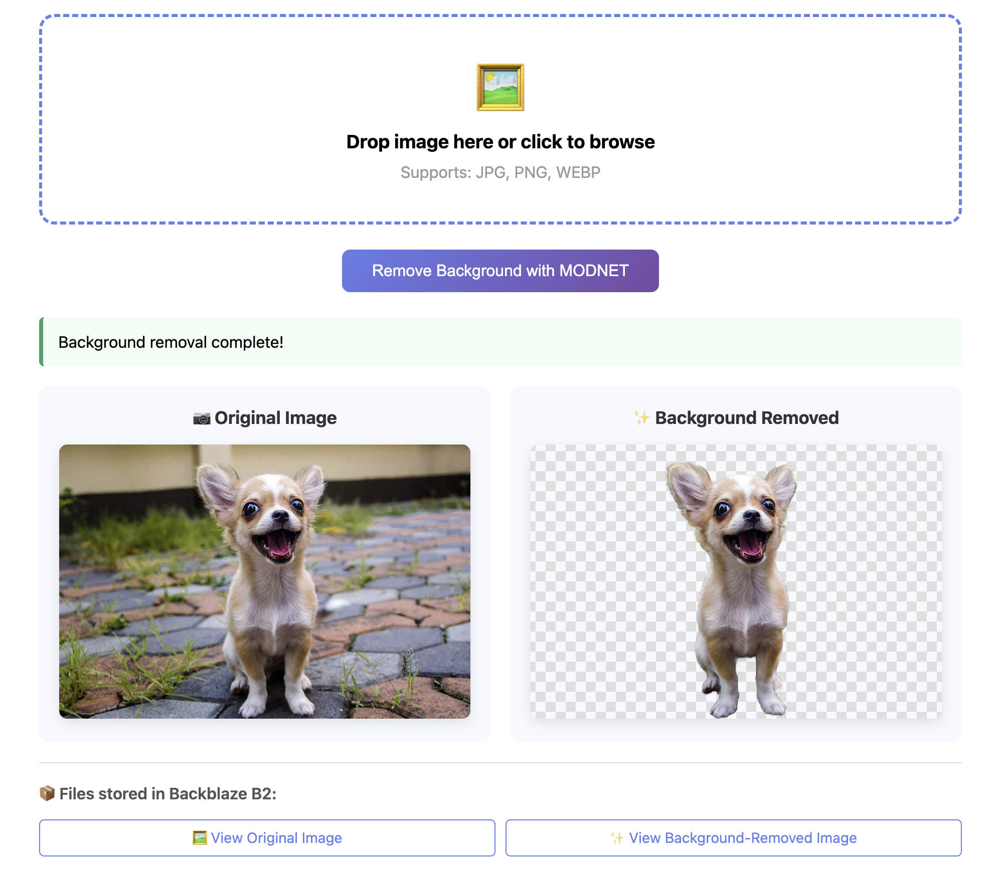

# 🖼️ B2 + Transformers.js Background Removal

**Client-side AI Image Background Removal** using [Transformers.js](https://huggingface.co/docs/transformers.js) and [Backblaze B2](https://www.backblaze.com/b2/cloud-storage.html?utm_source=github&utm_medium=referral&utm_campaign=ai_artifacts&utm_content=imagesamples) cloud storage.

Run **RMBG-1.4** (Remove Background Model) **inference** entirely in your browser - no server GPU needed, with images and processed results stored in cost-effective B2 storage.

## 🚀 Technologies

- **[Transformers.js](https://huggingface.co/docs/transformers.js)** - Run AI models in the browser with WebAssembly and WebGPU
- **[RMBG-1.4](https://huggingface.co/briaai/RMBG-1.4)** - State-of-the-art **background removal model** for **image segmentation**
- **[Backblaze B2](https://www.backblaze.com/b2/cloud-storage.html?utm_source=github&utm_medium=referral&utm_campaign=ai_artifacts&utm_content=imagesamples)** - S3-compatible cloud storage at $6/TB/month
- **Client-side Inference** - All AI processing happens locally in the browser

## ✨ What This Demonstrates

- **Client-side AI Inference**: Run RMBG-1.4 **background removal** model entirely in browser (no server GPU required)
- **Transformers.js Image Processing**: Real-time **image background removal** using **browser-based inference**
- **Cost-effective Storage**: Store original images and background-removed cutouts in Backblaze B2
- **Secure Uploads**: Direct browser-to-cloud uploads with pre-signed URLs
- **Simple Architecture**: Complete flow from upload → process → store



## Architecture

```
User → Upload Image → B2 Storage
                    ↓
Browser RMBG-1.4 Inference (Transformers.js) → Remove Background
                    ↓
      Cutout Image → B2 Storage
```

### Flow

1. User selects/drops image file in browser
2. Backend generates pre-signed PUT URL for B2
3. Browser uploads original image directly to B2
4. Browser loads **RMBG-1.4** model via **Transformers.js** (briaai/RMBG-1.4)
5. Browser performs **client-side inference** to remove background
6. Browser generates transparent PNG cutout
7. Backend generates pre-signed PUT URL for processed image
8. Browser uploads background-removed cutout to B2

## 🎯 Use Cases

Perfect for demonstrating **browser-based image inference** for:

- **E-commerce**: Product photo background removal
- **Profile Pictures**: Automatic portrait cutouts
- **Design Tools**: Quick image editing without Photoshop
- **Marketing**: Create transparent assets for campaigns
- **Real Estate**: Property photo editing
- **Fashion**: Model/clothing isolation

## 🚀 Quick Start

### Prerequisites

- **Node.js 18+**
- **[Backblaze B2 Account](https://www.backblaze.com/sign-up/cloud-storage?utm_source=github&utm_medium=referral&utm_campaign=ai_artifacts&utm_content=imagesamples)** (free tier available)
  - Create a bucket
  - Generate an Application Key with `readFiles`, `writeFiles`, `writeBuckets` permissions

### 1. Clone & Install

```bash
git clone https://github.com/backblaze-b2-samples/b2-transformerjs-background-removal.git
cd b2-transformerjs-background-removal/backend
npm install
```

### 2. Configure B2 Credentials

```bash
cp .env.example .env
```

Edit `.env` with your [B2 credentials](https://www.backblaze.com/b2/docs/quick_account.html?utm_source=github&utm_medium=referral&utm_campaign=ai_artifacts&utm_content=imagesamples):

```env
B2_ENDPOINT=https://s3.us-west-002.backblazeb2.com
B2_REGION=us-west-002
B2_KEY_ID=your_key_id_here
B2_APP_KEY=your_app_key_here
B2_BUCKET=your-bucket-name
```

> Get your B2 endpoint and region from your [bucket details page](https://secure.backblaze.com/b2_buckets.htm?utm_source=github&utm_medium=referral&utm_campaign=ai_artifacts&utm_content=imagesamples)

### 3. Start the App

```bash
npm start
```

**That's it!** The server automatically:
- ✅ Configures B2 CORS for browser uploads
- ✅ Serves both frontend and API
- ✅ Opens at `http://localhost:3000`

### 4. Use the App

1. Open **http://localhost:3000** in your browser
2. Upload an image file (JPG, PNG, WEBP)
3. Click **"Remove Background with MODNET"**
4. View before/after comparison and access files in B2

> ⚠️ First run downloads the **RMBG-1.4 model** (~176MB) - this takes 2-3 minutes

## 🔧 Technical Details

### Background Removal Model

- **Model**: [briaai/RMBG-1.4](https://huggingface.co/briaai/RMBG-1.4)
- **Task**: Image background removal / segmentation
- **Library**: [Transformers.js](https://huggingface.co/docs/transformers.js) - Run **transformer models** in the browser
- **Inference Backend**: WebGPU (falls back to WASM)
- **Model Size**: ~176MB (cached in browser after first load)
- **Speed**: ~2-5 seconds per image (depends on resolution)
- **Output**: PNG with transparency

### Transformers.js Integration

This example demonstrates **client-side transformer inference** using the **Transformers.js** library:

```javascript
import { AutoModel, AutoProcessor, RawImage } from '@huggingface/transformers';

// Load RMBG-1.4 model for background removal
const model = await AutoModel.from_pretrained('briaai/RMBG-1.4', {
  device: 'webgpu',
});
const processor = await AutoProcessor.from_pretrained('briaai/RMBG-1.4');

// Run inference on image
const image = await RawImage.fromURL(imageUrl);
const { pixel_values } = await processor(image);
const { output } = await model({ input: pixel_values });
```

### Storage

- **Provider**: [Backblaze B2](https://www.backblaze.com/b2/cloud-storage.html?utm_source=github&utm_medium=referral&utm_campaign=ai_artifacts&utm_content=imagesamples)
- **API**: S3-compatible API with pre-signed URLs
- **Pricing**: $6/TB/month storage, uploads are FREE
- **Documentation**: [B2 S3-Compatible API Docs](https://www.backblaze.com/b2/docs/s3_compatible_api.html?utm_source=github&utm_medium=referral&utm_campaign=ai_artifacts&utm_content=imagesamples)

### Supported Image Formats

**Input**: JPG, PNG, WEBP, GIF, BMP
**Output**: PNG with alpha transparency

### Browser Compatibility

- Chrome 113+ (WebGPU support)
- Edge 113+
- Opera 99+
- Safari 18+ (WebGPU experimental)
- Firefox (WASM fallback, no WebGPU yet)

Requires WebAssembly and ES6 modules support.

## Manual CORS Setup

If auto-setup fails (missing permissions), run manually:

```bash
npm run setup-cors
```

**Required B2 Key Permissions**:
- `listBuckets`
- `readFiles`
- `writeFiles`
- `writeBuckets` ← Required for CORS setup

**Alternative - B2 CLI**:

```bash
b2 update-bucket --cors-rules '[
  {
    "corsRuleName": "allowBrowserUploads",
    "allowedOrigins": ["*"],
    "allowedHeaders": ["*"],
    "allowedOperations": ["s3_put", "s3_get", "s3_head"],
    "maxAgeSeconds": 3600
  }
]' <bucket-name> allPublic
```

**Alternative - B2 Web Console**:
1. Go to [https://secure.backblaze.com/b2_buckets.htm](https://secure.backblaze.com/b2_buckets.htm?utm_source=github&utm_medium=referral&utm_campaign=ai_artifacts&utm_content=imagesamples)
2. Click your bucket → Bucket Settings → CORS Rules
3. Add the rules shown above

## API Endpoints

### POST /api/presign-image

Request:
```json
{
  "filename": "photo.jpg",
  "contentType": "image/jpeg"
}
```

Response:
```json
{
  "uploadUrl": "https://...",
  "publicUrl": "https://...",
  "key": "images/uuid.jpg",
  "fileId": "uuid"
}
```

### POST /api/presign-cutout

Request:
```json
{
  "fileId": "uuid"
}
```

Response:
```json
{
  "uploadUrl": "https://...",
  "publicUrl": "https://...",
  "key": "cutouts/uuid_cutout.png"
}
```

## Deployment

### Deploy Backend

**Railway / Render / Fly.io**:
- Set environment variables from `.env`
- Deploy `backend/` directory
- Update frontend `apiUrl` to deployed URL

**Docker**:
```dockerfile
FROM node:18-alpine
WORKDIR /app
COPY backend/package*.json ./
RUN npm install
COPY backend/ ./
CMD ["node", "server.js"]
```

### Deploy Frontend

**Static Hosting** (Netlify, Vercel, Cloudflare Pages):
- Deploy `frontend/` directory
- Set API URL in settings or hardcode in HTML

**B2 Static Hosting**:
- Upload `frontend/index.html` to B2 bucket
- Enable website hosting on bucket
- Access via B2 website URL

## Limitations

- First load downloads model (~176MB, one-time)
- Processing time depends on image resolution
- Browser must stay open during inference
- Very large images (>4K) may be slow
- WebGPU not yet supported in Firefox (uses slower WASM)

## 🎯 Potential Improvements

- [ ] Add batch processing for multiple images
- [ ] Support custom background colors/images
- [ ] Add edge refinement controls
- [ ] Progressive rendering for large images
- [ ] Download button for processed images
- [ ] Comparison slider for before/after
- [ ] Try alternative models (U2-Net, MODNet)
- [ ] Add WebWorker for non-blocking inference

## 📚 Learn More

- **[Transformers.js Documentation](https://huggingface.co/docs/transformers.js)** - Run AI models in the browser
- **[Transformers.js GitHub](https://github.com/xenova/transformers.js)** - Source code and examples
- **[RMBG-1.4 Model Card](https://huggingface.co/briaai/RMBG-1.4)** - Background removal model details
- **[Backblaze B2 Documentation](https://www.backblaze.com/b2/docs/?utm_source=github&utm_medium=referral&utm_campaign=ai_artifacts&utm_content=imagesamples)** - Cloud storage API docs
- **[B2 S3-Compatible API](https://www.backblaze.com/b2/docs/s3_compatible_api.html?utm_source=github&utm_medium=referral&utm_campaign=ai_artifacts&utm_content=imagesamples)** - S3 compatibility guide
- **[WebGPU Guide](https://developer.mozilla.org/en-US/docs/Web/API/WebGPU_API)** - Browser GPU acceleration

## Keywords

**Image Background Removal**, **Transformers.js**, **Browser-based Inference**, **Client-side AI**, **RMBG-1.4**, **MODNET**, **Image Segmentation**, **WebGPU**, **JavaScript AI**, **Machine Learning in Browser**, **Backblaze B2**, **S3-Compatible Storage**, **Pre-signed URLs**

## Troubleshooting

### CORS Error: "Access to fetch has been blocked by CORS policy"

**Problem**: Browser shows CORS error when uploading.

**Solution**:
1. Run `npm run setup-cors` in the backend directory
2. Or manually configure CORS on your B2 bucket (see Setup section)
3. Verify CORS is set: Go to B2 Console → Your Bucket → Settings → CORS Rules

### Model Loading is Slow

**Problem**: First run takes a long time.

**Solution**:
- RMBG-1.4 is ~176MB and downloads on first use
- Model is cached by browser for subsequent uses
- Try using faster internet connection
- Check browser console for download progress

### WebGPU Not Available

**Problem**: Browser doesn't support WebGPU.

**Solution**:
- Use Chrome 113+, Edge 113+, or Opera 99+
- Firefox will fall back to WASM (slower but works)
- Update browser to latest version
- Check chrome://gpu to verify WebGPU status

### Backend Connection Error

**Problem**: Frontend can't connect to backend API.

**Solution**:
1. Verify backend is running: `curl http://localhost:3000/health`
2. Check API URL in frontend matches backend (default: `http://localhost:3000`)
3. Look for CORS errors in backend logs

## License

MIT
